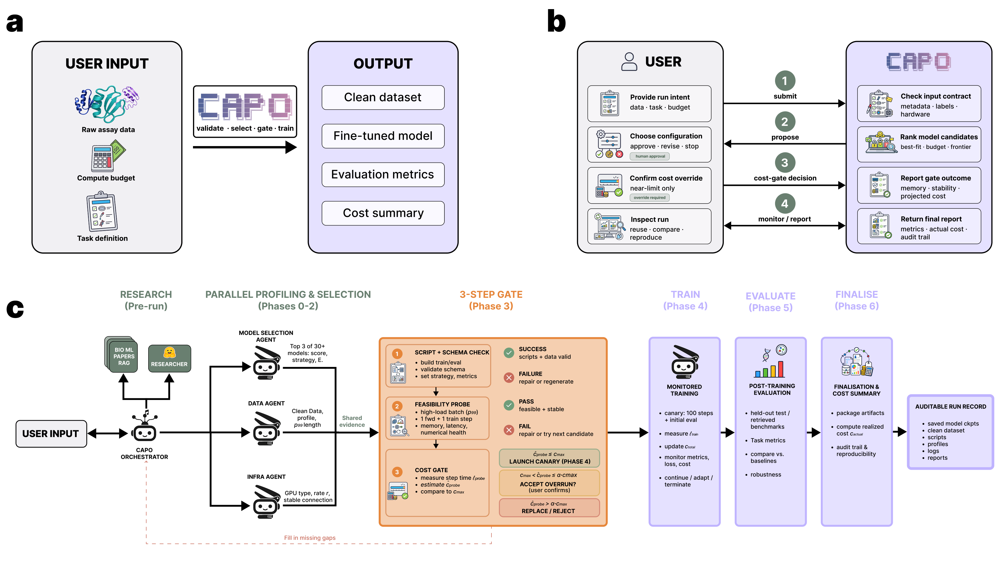
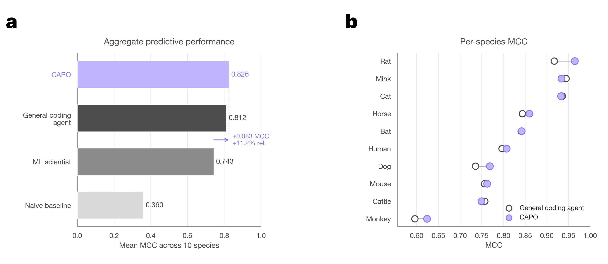
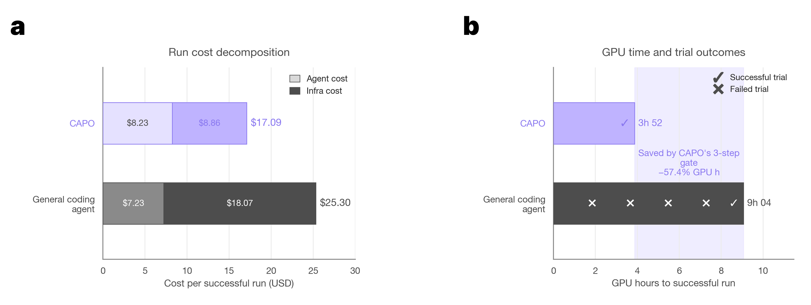

<p align="center">
  
</p>

# CAPO — Compute-Aware Automated Protein-Model Optimization

**From raw assay data to fine-tuned models, on a budget.**

CAPO adapts protein language models through a gated agentic workflow. Given raw assay data, a task definition and a compute budget, the system validates the input contract, profiles the dataset, ranks candidate models, runs an empirical feasibility probe on the target accelerator, checks projected cost against the budget and only then launches monitored training. Every candidate that fails validation, exceeds memory, produces non-finite values or violates the budget is repaired, replaced or rejected before any GPU-intensive work begins. The run emits an auditable record containing preprocessing decisions, dataset statistics, feasibility measurements, training traces, evaluation results and realised cost.

The worked example throughout this repo is RBD–ACE2 binding prediction from yeast-display sequencing data, see [Evaluation](#evaluation).

---

## System overview

<p align="center">
  
</p>

CAPO is organised into three blocks, primed by episodic memory:

- **Episodic memory (Pre-run /Phase 6).** Every completed run writes a scientific `RUN_REPORT.md` and registers its frontmatter in a cross-run index (`runs/runs_index.md`). Before each new run, a memory-consultant agent scans that index, selectively loads the few most relevant past reports (progressive disclosure) and writes advisory priors that prime the downstream pre-launch agents. Priors are never authoritative, current-run artifacts override them on conflict.
- **Profiling & model selection (Phases 0–2).** A data agent extracts the biological sequence, removes assay-specific regions, filters invalid records, translates nucleotide sequences when required and reports class balance and length statistics. In parallel, model-selection and infrastructure agents rank PLM configurations by task fit, expected cost and hardware feasibility.
- **Compute-aware admission control (Phase 3).** A three-step gate runs before any training launch: (1) script + schema validation, (2) an empirical feasibility probe at p99-length on the target GPU (forward, then forward+backward), (3) a projected-cost check against `max_cost_usd`. Failures route to repair, replace, reject or escalate.
- **Monitored training, evaluation & finalisation (Phases 4–6).** Training is launched under `nohup` inside a persistent `capo_remote` tmux session. A concurrent Haiku health monitor polls remote state read-only (60s for the first 15 min, then every 5 min), parses metrics and alerts and writes `reports/health/history.jsonl`. On terminal state, artifacts are synced back and the finalizer writes `final_summary.json`.

---

## Environment setup

CAPO requires access to Lambda Cloud and the Hugging Face Hub. It connects to Lambda Cloud over SSH and uses Hugging Face for datasets, the Trackio Space and model uploads.

Create a `.env` file at the repository root with the following secrets. The file is loaded automatically via `python-dotenv`.

```bash
# .env
ANTHROPIC_API_KEY=...  # for Claude Agent SDK access
LAMBDA_API_KEY=...     # create one at https://cloud.lambda.ai/api-keys/cloud-api
HF_TOKEN=hf_...        # for datasets, Trackio and model uploads
```

Or export in your shell (`~/.zshrc` / `~/.bashrc`) for session-wide persistence:

```bash
export ANTHROPIC_API_KEY="..."
export LAMBDA_API_KEY="..."
export HF_TOKEN="hf_..."
```

You also need a **private SSH key in `~/.ssh/`** whose public counterpart is registered with Lambda Cloud at https://cloud.lambda.ai/ssh-keys. The key path and the registered key name both go into the YAML config (`key_path`, `ssh_key_name`).

---

## Quickstart

### 1. Install

```bash
git clone git@github.com:AI-BIIE-Initiative/autoimmunolab.git
cd autoimmunolab
uv sync
```

Requires Python 3.11+ (pinned in `.python-version`) and [`uv`](https://docs.astral.sh/uv/).

### 2. Configure

Open `scripts/configs/fine_tuning.yaml` and update at least the following fields:

| Field | What to set |
|---|---|
| `key_path` | Absolute or `~`-expanded path to your private SSH key (e.g. `~/.ssh/lambda_private`) |
| `ssh_key_name` | The key's name as registered in your Lambda Cloud account |
| `gpu_preference` | Preferred GPU tier, e.g. `1x A100`, `1x GH200`. Leave `null` to let the infra agent decide |
| `model_id` | Hugging Face model ID to fine-tune (e.g. `facebook/esm2_t6_8M_UR50D`) |
| `fine_tune_strategy` | `linear-probe` \| `lora` \| `full` |
| `dataset_ref` | Hugging Face dataset ID or local path (e.g. `BIIE-AI/ace2_binding`) |
| `max_cost_usd` | Hard cap on projected GPU cost. Runs aborting at the cost gate respect this |
| `trackio_space_id` | Trackio dashboard Space. Leave `null` (recommended), CAPO derives `<hf-user>/capo-trackio` and creates it on first run |
| `task_file` *(or `task`)* | Path to a markdown file describing the task, or an inline string |

The remaining fields have sane defaults — `compaction_*` knobs and agent settings rarely need editing.

### 3. Run

CAPO ships two front ends over the **same** orchestrator and the **same** config
(`scripts/configs/fine_tuning.yaml`) — pick whichever fits.

**A · Interactive TUI (recommended)** — `capo` opens a run assistant
that shapes the task through a short chat, shows a run-plan card, asks you to
confirm the budget, then launches into a full-screen live run view (streaming
logs + a pinned command bar). It also exposes inspection commands (`history`,
`health`, `inspect`, `resume`, `config`, …).

```bash
capo                        # chat → confirm budget → live run view
capo --auto                 # skip the chat; launch from the config
capo history                # list recent runs
capo health <run_id> -w     # live health card for a run
```

See **[`src/capo/cli/README.md`](src/capo/cli/README.md)** for the full command
list, slash commands and how to edit the config from inside the CLI.

**B · Headless Python script** — no live prompts, config-driven, ideal for CI /
scripted launches. Reads the same YAML and runs the pipeline end-to-end.

```bash
python scripts/run_fine_tuning.py --config scripts/configs/fine_tuning.yaml
```

### Or: raw data processing only

Convert raw paired-end FASTQs into a labeled PLM-ready CSV, no fine-tuning. The agent provisions a Lambda CPU instance, infers the experimental structure from filenames (species, date, sort gates, libraries), runs the 4-step yeast-display pipeline in parallel and pulls the cleaned CSV back locally. With `systems:` set in the config it runs in leakage-isolated harness mode (CAPO + General Coding Agent on the same inputs, then a deterministic Stage-2 evaluation against `BIIE-AI/ace2_binding`).

```bash
python scripts/run_raw_data_processing.py --config scripts/configs/raw_data_processing.yaml
```

---

## What happens when you run it

| Phase | Action |
|---|---|
| Pre-run | Consult episodic memory — scan `runs/runs_index.md`, load the 0–3 most relevant prior `RUN_REPORT.md` bodies, write advisory priors to `reports/prior_runs.md` |
| Pre-run | Do research on HuggingFace - find training datasets, eval benchmarks, model hyperparameters and write them in `research_findings.json` |
| 0 | Secure GPU — attach a running instance or provision a new one (budget-aware) |
| 1 | Profile dataset — 4-stage pipeline producing `profile.json` and plots |
| 2 | Write `probe.py`, `train.py`, `eval.py` and rsync to the instance |
| 3 | Feasibility probe at p99-length → `probe_result.json`, then cost gate |
| 4 | Launch training under `nohup` in `capo_remote` tmux; initialise trackio |
| 5 | Concurrent Haiku health monitor appending to `reports/health/history.jsonl` |
| 6 | Sync artifacts, diagnose failures if any, write `final_summary.json` + a scientific `RUN_REPORT.md` and append its frontmatter to `runs/runs_index.md` |

---

## Artifacts

Each run writes a self-contained, auditable directory to `runs/<run_id>/`
locally (the remote mirror lives at `~/capo_runs/<run_id>/` on the instance).
Every artifact is optional and degrades gracefully — a stage that didn't run
simply leaves its file out.

```
runs/<run_id>/
├── task.md                     # enriched task brief read by every pre-launch agent
├── state.json                  # session manifest — resume / pause state
├── manifest.json               # run manifest
├── infra.json                  # GPU / instance selection (Phase 0)
├── requirements.txt            # pinned remote dependencies
├── probe.py  train.py          # generated scripts (canonical copies under src/)
├── profile/
│   ├── profile.json            # dataset profile (Phase 1)
│   ├── probe_batch_recipe.json # p99-length batch recipe for the probe
│   └── plots/                  # profiling plots
├── probe/
│   ├── probe_result.json       # feasibility-probe measurements (Phase 3)
│   └── probe.log
├── pricing/
│   └── cost_report.json        # projected cost vs budget (cost gate)
├── configs/                    # training.yaml, evaluation.yaml, experiment.yaml, …
├── src/                        # canonical training / eval source
├── reports/
│   ├── prior_runs.md           # advisory priors (Pre-run, selected past runs)
│   ├── research_findings.json  # HF Hub research (Pre-run)
│   ├── model_selection.json    # candidate PLMs + chosen recipe
│   ├── handoff.json            # ssh_alias, pid, trackio_url, launched_at
│   ├── trackio_check.json      # verified trackio seeding (truthful, pre-handoff)
│   ├── health/history.jsonl    # one HealthReport per line (Phase 5)
│   ├── final_summary.json      # terminal state, final metrics, checkpoint paths (Phase 6)
│   └── FAILURE_REPORT.md       # written only when a run fails
├── outputs/                    # logs + remote run state
│   ├── run.log  run_err.log    # local orchestrator progress (what the TUI streams)
│   ├── stdout.log  stderr.log  # remote training stdout / stderr (synced back)
│   ├── status.json  metrics.jsonl
│   └── train.pid
├── results/                    # metrics.json, per-species + comparison CSVs, plots/, predictions/
├── checkpoints/                # best/ last/ (+ baseline/ for zero-shot contrasts)
├── compaction/                 # case_file.{json,md} — Phase A→C context handoff
└── RUN_REPORT.md               # scientific summary written by the finalizer (Phase 6)
```

Checkpoints live on the instance during training (source of truth); the finalizer
pushes `checkpoints/best/` to a private HF Hub repo on terminal state. The
finalizer also appends this run's `RUN_REPORT.md` frontmatter to the shared
**cross-run index** at `runs/runs_index.md` — the episodic memory that future runs
consult in Phase -2.

Resume an interrupted or paused run with `capo resume <run_id>` (or set
`restart_from_checkpoint: true` + `resume: <run_id>` in the YAML and re-run the
script). CAPO resumes from the latest on-instance checkpoint; a paused run re-asks
its pending question (`capo resume <run_id> --answer accept`).

---

## Evaluation

The reference dataset was generated by screening a yeast-displayed SARS-CoV-2 Omicron BA.1 RBD mutagenesis library against a panel of 10 ACE2 orthologs (rat, mink, cat, horse, bat, human, dog, mouse, cattle, monkey), producing paired RBD–ACE2 examples labelled by binding outcome. The task is to predict whether a given RBD sequence binds a given ACE2 ortholog, including for variants and species not seen during training. We report **macro-MCC** because it provides a balanced assessment of binary classification under class imbalance.

<p align="center">
  
</p>

CAPO reaches **macro-MCC 0.826**, exceeding the ML-scientist baseline by **+0.083 (+11.2% relative)** and matching or exceeding the general coding agent on **7/10 species**, with the largest gains on the lower-MCC species.

<p align="center">
  
</p>

CAPO eliminates failed trials, cutting **GPU time by 57.4%** and **total run cost by 32.5%** relative to the general coding agent.

---

## Repository layout

```
scripts/                        Entry points
  run_fine_tuning.py            Main entry — reads configs/fine_tuning.yaml
  run_inference.py              Inference entry — reads configs/inference.yaml
  configs/                      YAML configs
src/capo/
  cli/                          capo CLI — chat, live run view, commands (see cli/README.md)
  orchestration/                FineTuningOrchestrator, AgentRunner, SUBAGENTS registry
  observability/                ProgressEmitter, TrainingHealthMonitor
  persistence/                  SessionStore — atomic JSON manifests
  memory/                       Episodic memory — RUN_REPORT.md + runs_index.md helpers
  research/                     Pre-launch HF Hub research helper
  remote/                       LambdaSession, RsyncManager, TmuxManager, run lifecycle
  mcp/                          Three MCP servers (lambda, local, docker)
skills/                         41 skill SKILL.md files (profiling-datasets, model-selection, …)
docs/                           CAPO documentation and figures
```

---

## Troubleshooting

- **Module import errors** — re-run `uv sync`; always execute via `uv run python ...` if you don't have the venv activated.
- **Python version mismatch** — install the version in `.python-version`, then re-run `uv sync`.
- **`LAMBDA_API_KEY` not set** — export it (see [Environment setup](#environment-setup)) and verify with `echo $LAMBDA_API_KEY`. Required for any new provisioning.
- **SSH key not found / permission denied** — confirm `key_path` in the YAML points to a real private key in `~/.ssh/` (e.g. `~/.ssh/lambda_private`) and that `ssh_key_name` matches the name registered at https://cloud.lambda.ai/ssh-keys.
- **`HF_TOKEN` 401 or private dataset access denied** — re-export the token and check it has read access to `dataset_ref` and write access to `trackio_space_id`.
- **Probe fails repeatedly** — check `runs/<run_id>/probe/probe_result.json` for the failure mode. `probe_max_retries` (default `3`) controls self-repair attempts; recurring OOMs usually mean a smaller `model_id`, a lighter `fine_tune_strategy`, or a larger GPU is needed.
- **Resumed run doesn't pick up the latest checkpoint** — confirm `runs/<run_id>/state.json` exists and the remote instance is still alive; the orchestrator resumes from the latest checkpoint on the instance, not from local copies. Resume with `capo resume <run_id>`.
- **`capo` command not found** — re-run `uv sync` (installs the `capo` entry point) or invoke it as `python -m capo.cli`.
- **Live run view looks garbled** — set `CAPO_RUN_UI=plain` to fall back to plain streaming; the run itself is unaffected.
